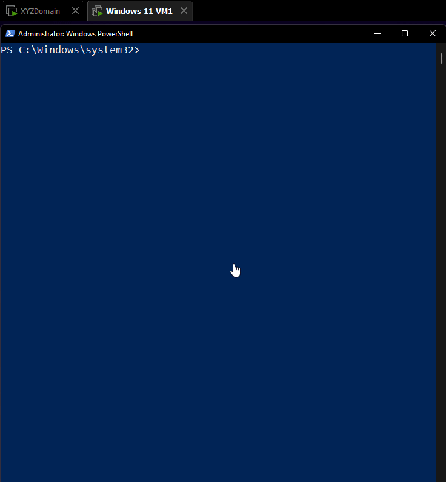
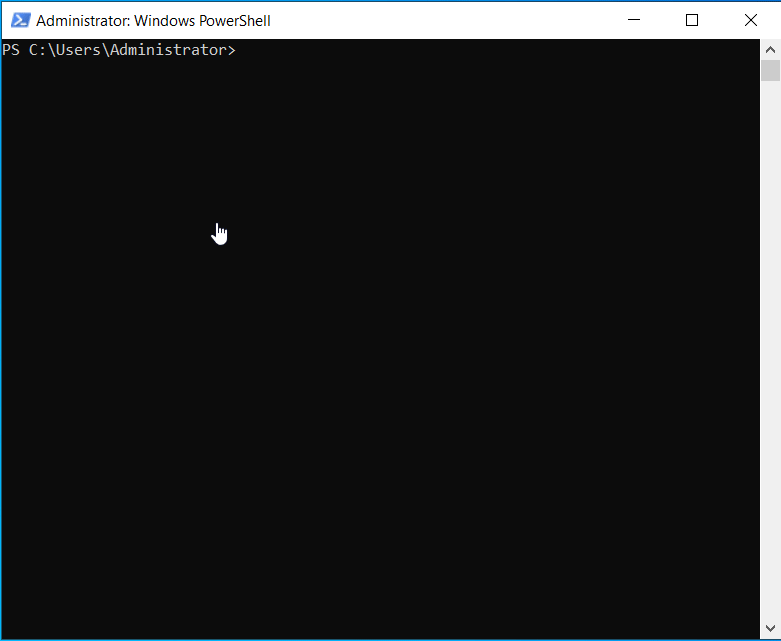
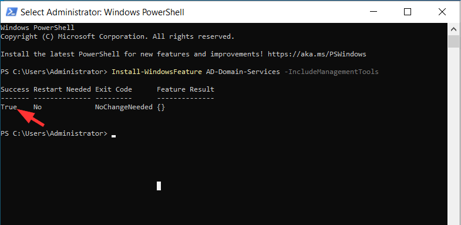
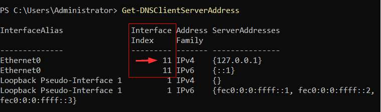
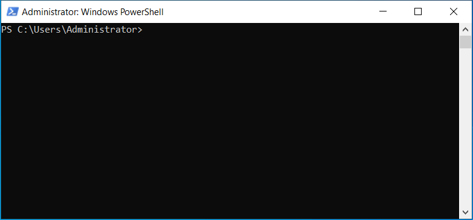

## Windows Setup

Here I followed John Hammon's video on the setup for Windows 11 and Server 2022. What is special about this video is learning to use linked snapshot clones and the registry hack to make Windows 11 install without TPM and without encrypting the drive so that way we are able to clone..

I could not test the following script because of lazyness to retype on the  setup console, how ever the following should give an idea of the registry keys requited for Windows 11 to be able to install.

```cmd  
reg  add  HKEY_LOCAL_MACHINE\SYSTEM\Setup\LabConfig
reg  add  HKEY_LOCAL_MACHINE\SYSTEM\Setup\LabConfig /v  BypassTPMCheck /t  REG_DWORD /d  1
reg  add  HKEY_LOCAL_MACHINE\SYSTEM\Setup\LabConfig /v  BypassRAMCheck /t  REG_DWORD /d  1
reg  add  HKEY_LOCAL_MACHINE\SYSTEM\Setup\LabConfig /v  BypassSecureBootCheck /t  REG_DWORD /d  1
```

## Enabling PSRemoting

Prior to the workstation joining domain, the following are not yet setup on the client.

> - WinRM is not configured/started
> - The client is not yet part of the domain
> - The domain controller is not trusted by the client computer

John Hammond's video sets up PSRemoting on the **server** by simply typing. 
```powershell
Enable-PSRemoting
```

However this may not be necessary as on his video he does not get a message confirming that any particular actions were successful or whether the previous action to enable remoting has failed.


I have found PSRemoting could be enabled differently having found the following script from [Jake Morrison's repository](https://github.com/techthoughts2/Learn-PowerShell-Code-Examples/blob/master/LearnPowerShell/EP9%20-%20PowerShell%20Remoting.ps1) and watching [this video](https://youtu.be/qvJRaYlxI1w?t=186) on Youtube. 


```powershell
# basic WinRM configuration with default settings
winrm quickconfig
```

Note the script available to view trusted hosts on the client machine. 
```powershell
# check winrm settings
winrm get winrm/config/client
```

It is also useful to determine WinRM is running or not. On my system I ran `winrm get winrm/config/client` and got an error on the client while the server gave a result indicating that WinRM is already setup on the server.





John  starts the service on the client by in administrator powershell

```powershell
Start-Service WinRM
```


From Jake Morrison, adding the hosts to TrustedHosts can be done like this :

```cmd
#add server to trusted hosts

Get-ChildItem WSMan:\localhost\Client\TrustedHosts
winrm s winrm/config/client '@{TrustedHosts="theComputerName"}'
```

The powershell version :

```powershell
Set-Item WSMan:localhost\client\trustedhosts -value theComputerName
```

Another way to verify both credentials and that the remote computer is configured for WinRM, from Jake Morrison's repository we see

```powershell
#verify that WinRM is setup and responding on a remote device
#you must specify the authentication type when testing a remote device.
#if you are unsure about the authentication, set it to Negotiate

$credential = Get-Credential
Test-WSMan RemoteDeviceName -Authentication Negotiate -Credential $credential
```

## Change Computername and DNS for Server
John did not install the GUI in order to demonstrate the use of Powershell to setup the services
`Sconfig`  is used to change  ::

> - Computername
> - IP Address
> - Subnetmask
> - Default Gateway
> - DNS 




## Joining The Computer to Domain

```powershell
Install-WindowsFeature AD-Domain-Services -IncludeManagementTools
```

The result should look similar to the screenshot below. I missed capturing the screen the first time I did it. For that reason you are a seeing a 



```powershell
import-Module ADDSDeployment
install-ADDSForest
```

After the server reboots, the DNS server settings are set to 127.0.0.1
One may need to change it to the original settings. The `InterfaceIndex` needs to be determine first.

```powershell
Get-DNSClientServerAddress
```



Following this, the original ones may be defined.

```powershell
Set-DNSClientServerAddress -InterfaceIndex 11 -ServerAddresses 192.168.1.155
```


