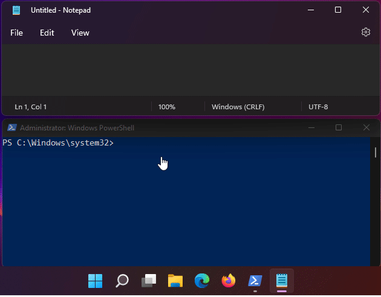
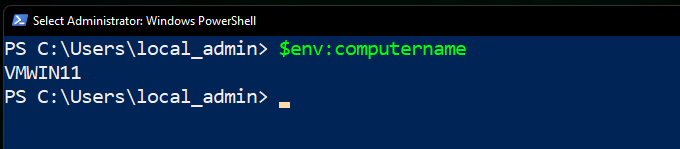

## Join the workstation to the Domain

Now that the server is setup it is time to joing the workstation to the domain. However the workstation needs to point its dns resolver settings to the new server. After that is done, the computer will be able to join the domain.

### Changing the DNS server of the workstation

#### Discovering the InterfaceIndex of computer

> - Discover current IP Address
> - Discover IntterfaceIndex associated with that IP
> - Construct Powershell command to set DNS Addresses for that Interface


```cmd
ipconfig 
```


```powershell
Get-NetIPAddress -IPAddress 192.168.1.15
```


Construction the powershell command ...

```powershell
Set-DnsClientServerAddress -InterfaceIndex 4 -ServerAddresses ("192.168.1.155","192.168.1.254")
```

Execution ...



## Finally adding the workstation

### Renaming Current Workstation Name

On my lab the workstations are built from a workstaion whose computer name is `VMWIN11`


Since this is the generic name for all the templates, I needed to change the current computer name to WS1 (for Wokrstionn 1).

```powershell
$credentialWS1 = (Get-Credential)
Rename-Computer -NewName "WS1" -LocalCredential $credentialWS1 -Restart

```

### Adding the new computer to the domain

```powershell

Add-Computer -DomainName xyz.com

```

